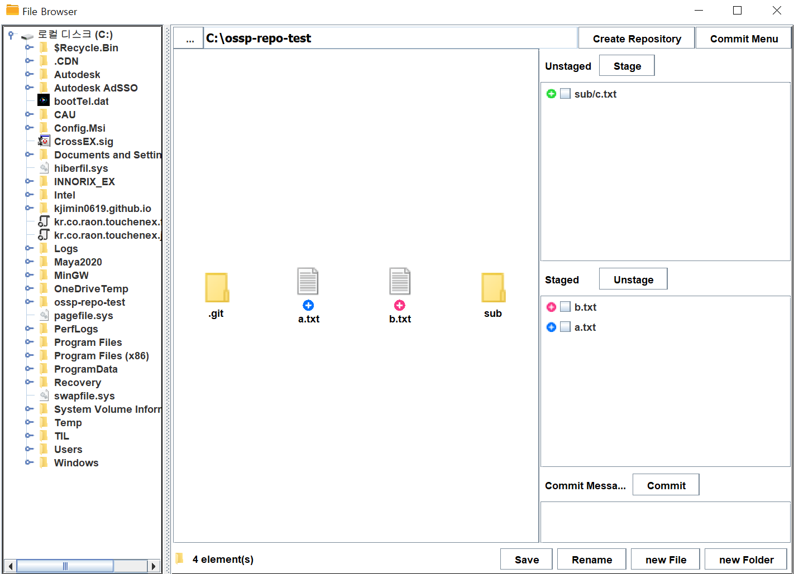

   

# FileBrowser - Implementing Git Utilities

***
## **Project Introduction**
> 중앙대학교 소프트웨어학부 23-1 오픈소스SW프로젝트 과목 과제 진행을 위한 레퍼지토리 입니다. 과제에서 요구되는 GUI-based git repository management service를 구현했습니다.
### **Application**

todo : 제공하는 기능에 대한 간단 설명 추가

   

## **How to Execute**

**개발 및 실행 환경 : IntelliJ IDEA Ultimate**  
**언어 및 버전 : JAVA, JDK-17**  
**빌드 툴 및 버전 : gradle 8.0**  

### 아래는 프로젝트 실행 방법입니다.
1. 프로젝트를 클론합니다. `git clone https://github.com/advicewook/FileBrowser.git`
2. IntelliJ Ultimate IDEA로 clone한 프로젝트 폴더를 엽니다.  
3. Load Gradle Project후에 IntelliJ Ultimate IDEA의 인덱싱이 끝날 때까지 기다립니다. 이는 우측 하단의 프로그레스바에서 확인할 수 있습니다.  
4. 우측 상단 Gradle 탭을 열고 reload합니다.  
   
5. File > Settings에서 Intellij의 설정값을 아래와 같이 변경합니다. 아래에서 Gradle user home 경로는 예시입니다.
   
   
6. File > Project Structure에서 Intellij의 설정값을 아래와 같이 변경합니다.
   
7. reload가 끝나면 우측 상단의 Edit Configuration 창을 엽니다.  
     
8. 아래 이미지를 참고하여 설정값을 변경합니다. JDK17이 없다면 우측 링크에서 다운로드받으실 수 있습니다.(https://www.oracle.com/kr/java/technologies/javase/jdk17-archive-downloads.html)  
     
9. 설정이 완료되면 저장 후 Configuration창을 닫습니다. 이후 우측 상단에서 Run 버튼을 눌러 애플리케이션을 실행할 수 있습니다.  
     
10. 실행 결과 예시  
     

### 아래는 gradle을 이용한 빌드 후 jar파일 실행 방법입니다.  
1. 프로젝트 실행 방법의 6번까지 완료한 후 7번을 실행합니다.  
2. 아래 이미지를 참고하여 설정값을 변경합니다.  
     
3. 설정이 완료되면 저장 후 Configuration창을 닫습니다.
4. 설정을 마친 후, 우측 상단에서 Run 버튼을 눌러 gradle 빌드 명령을 실행합니다.  
     
6. 빌드가 성공적으로 끝났다면 아래와 같은 로그가 출력되고, 빌드 결과물은 /build/libs에 jar파일로 생성됩니다.  
     
7. 이 결과물은 `java -jar FileBrowser-1.0-SNAPSHOT.jar`으로 실행할 수 있습니다.   
8. 실행 결과 예시  
      

   

## **Main History**

|날짜|진행 상황|
|--|--|
|23-04|적절한 오픈 소스 탐색 및 프로그래밍 언어 선정|
|23-05-01|eclipse project를 gradle project로 변경|  
|23-05-03|1. commit menu ui 추가    2. 커밋 패널 생성 완료   3. commit menu, repository creation 버튼 기능 구현 완료|
|23-05-04|1. 커밋 패널 기능 구현 완료   2. 팝업 메뉴 기능 구현 완료|
|23-05-05|1. 파일 상태 아이콘 제작 완료   2. 커밋 패널 기능 개선|
|23-05-09|중앙 패널, 커밋 메뉴, 커밋 패널 기능 개선|
|23-05-10|1. 레포지토리 하위 폴더 동작 오류 개선 (status에 따른 팝업 메뉴 생성 및 선택 시 기능 동작)    2. 커밋 기능 구현 완료   3. 중앙 패널 안 파일의 상태 표시 아이콘 기능 완성 |
|23-05-11|팝업 메뉴 오류 개선 및 일부 코드 수정|
|23-05-12 ~ 05-14| 문서 및 리드미 작성|

   

## **Details About Implementation**
### 주요 의존성
- Jgit : Eclipse Foundation에서 관리하는, git 명령어를 java 메서드로 호출할 수 있도록 지원합니다.
- Swing : 자바로 작성된 GUI 라이브러리입니다. 자바 기반의 그래픽 인터페이스를 만들 수 있는 클래스를 제공합니다.

### 참고 리포지토리
- https://github.com/centic9/jgit-cookbook
  - Jgit을 편하게 사용할 수 있도록 git 기능에 대한 code snippet을 제공합니다.

### 자바 클래스
- FileBrowser : 파일 브라우저를 구현하는 핵심 클래스입니다.
- CustomJgitUtilities : jgit을 사용한 git 기능 구현을 담당하는 클래스입니다.
- CustomSwingUtilities : swing을 사용해 gui을 구현하는 클래스입니다.

***
## Original Project Introduction
> Writing a simple file browser in Java SWING

원본 프로젝트는 java로 구현한 file browser입니다.
***
### Links
- [E-mail : ](mailto:m.elkhou@hotmail.com) m.elkhou@hotmail.com
- [GitHub](https://github.com/m-elkhou)

