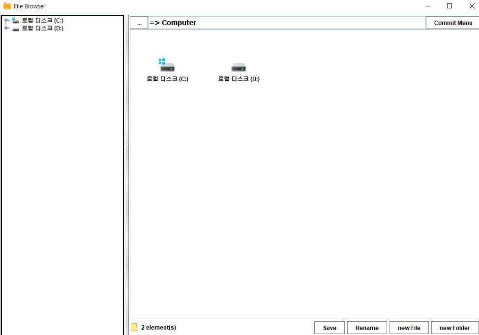
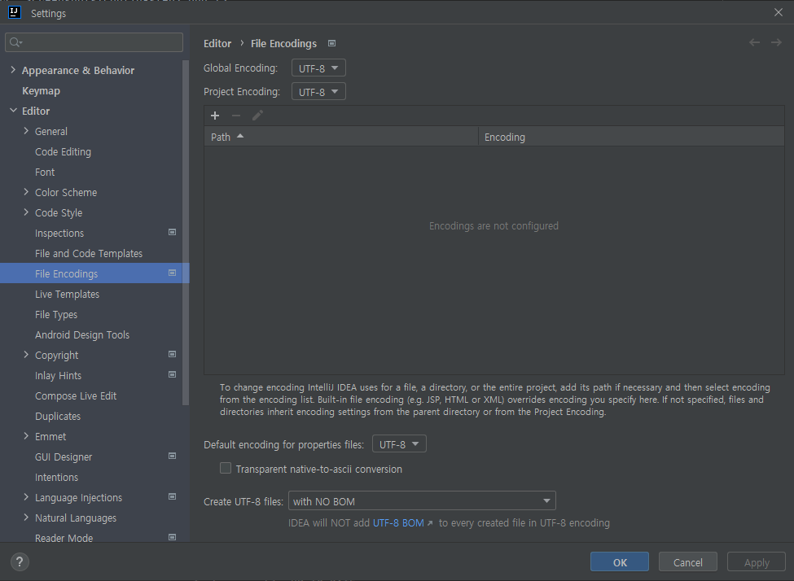

# FileBrowser - Implementing Git Utilities
***
# Project Introduction
> file browser에 과제에서 요구되는 git gui 기능을 구현했습니다.
## How to Execute

개발 및 실행 환경은 IntelliJ Ultimate IDEA를 사용했습니다.  

### 아래는 프로젝트 실행 방법입니다.
1. 프로젝트를 클론합니다. `git clone https://github.com/advicewook/FileBrowser.git`
2. IntelliJ Ultimate IDEA로 clone한 프로젝트 폴더를 엽니다.  
3. IntelliJ Ultimate IDEA의 인덱싱이 끝날 때까지 기다립니다. 이는 우측 하단의 프로그레스바에서 확인할 수 있습니다.  
4. 우측 상단 Gradle 탭을 열고 reload합니다.  
   
5. reload가 끝나면 우측 상단의 Edit Configuration 창을 엽니다.  
     
6. 아래 이미지를 참고하여 설정값을 변경합니다. jdk는 14.0.1을 사용했습니다. jdk가 없다면 우측 링크에서 다운로드받으실 수 있습니다.(https://www.oracle.com/kr/java/technologies/javase/jdk14-archive-downloads.html)  
     
7. 설정이 완료되면 저장 후 Configuration창을 닫습니다. 이후 우측 상단에서 Run 버튼을 눌러 애플리케이션을 실행할 수 있습니다.  
     
8. 실행 결과 예시  
     

### 아래는 gradle을 이용한 빌드 후 jar파일 실행 방법입니다.  
1. 프로젝트 실행 방법의 5번까지 실행합니다.  
2. 아래 이미지를 참고하여 설정값을 변경합니다.  
     
3. 설정이 완료되면 저장 후 Configuration창을 닫습니다.  
4. 좌측 상단 'File > Settings > Editor > File Encodings'에서 Global Encoding과 Project Encoding이 모두 UTF-8로 되어 있는지 확인 후, UTF-8이 아니라면 UTF-8로 변경합니다. (코드에 한글 주석이 있기 때문에 필요한 과정입니다.)  
     
5. 설정을 마친 후, 우측 상단에서 Run 버튼을 눌러 gradle 빌드를 실행합니다.  
     
6. 빌드가 성공적으로 끝났다면 아래와 같은 로그가 출력되고, 빌드 결과물은 /build/libs에 jar파일로 생성됩니다.  
     
7. 이 결과물은 `java -jar {빌드 결과물 이름}`으로 실행할 수 있습니다.   
8. 실행 결과 예시  
      

## Main History
- 2023-04 : 적절한 오픈소스 탐색 및 프로그래밍 언어 선정  
- 2023-05-01 : eclipse project를 gradle project로 변경  
- 2023-05-03 : commit menu ui 추가  
- 2023-05-03 : create repository 버튼 생성

## Details About Implementation
### 주요 의존성
- Jgit : Eclipse Foundation에서 관리하는, git 명령어를 java 메서드로 호출할 수 있도록 지원합니다.
- Swing : 자바로 작성된 GUI 라이브러리입니다. 자바 기반의 그래픽 인터페이스를 만들 수 있는 클래스를 제공합니다.

### 참고 리포지토리
- https://github.com/centic9/jgit-cookbook
  - Jgit을 편하게 사용할 수 있도록 git 기능에 대한 code snippet을 제공합니다.

### 자바 클래스
- FileBrowser : 파일 브라우저를 구현하는 핵심 클래스입니다.
- CustomJgitUtilities : jgit을 사용한 git 기능 구현을 담당하는 클래스입니다.
- CustomSwingUtilities : swing을 사용해 gui을 구현하는 클래스입니다.

## Collaboration History
- TODO

***
## Original Project Introduction
> Writing a simple file browser in Java SWING

원본 프로젝트는 java로 구현한 file browser입니다.
***
### Links
- [E-mail : ](mailto:m.elkhou@hotmail.com) m.elkhou@hotmail.com
- [GitHub](https://github.com/m-elkhou)

