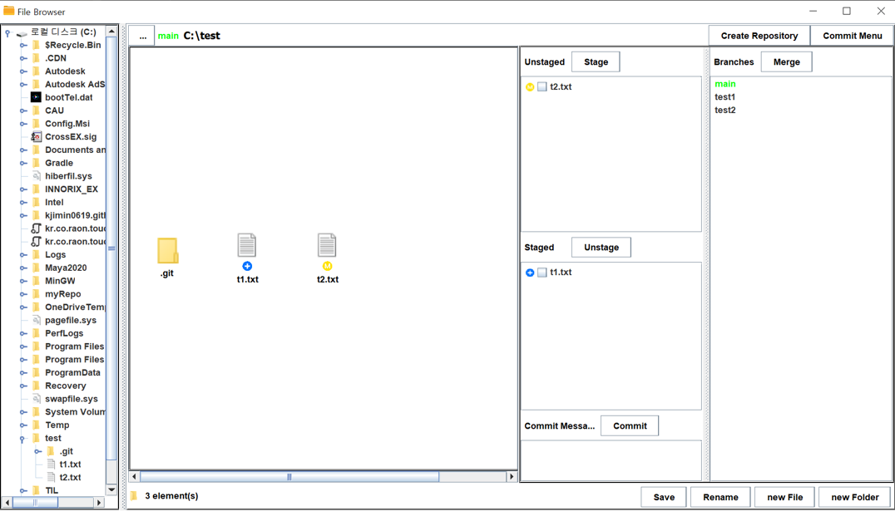
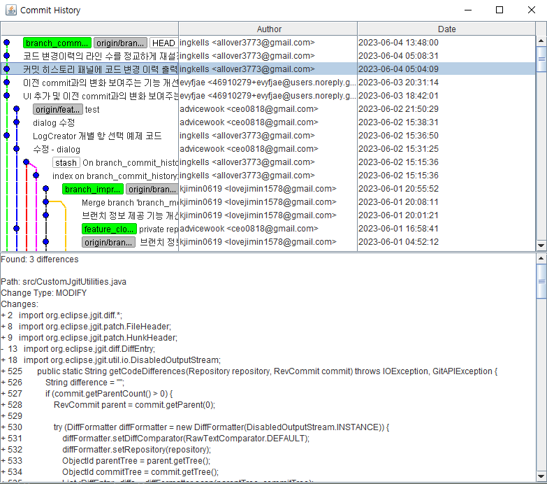
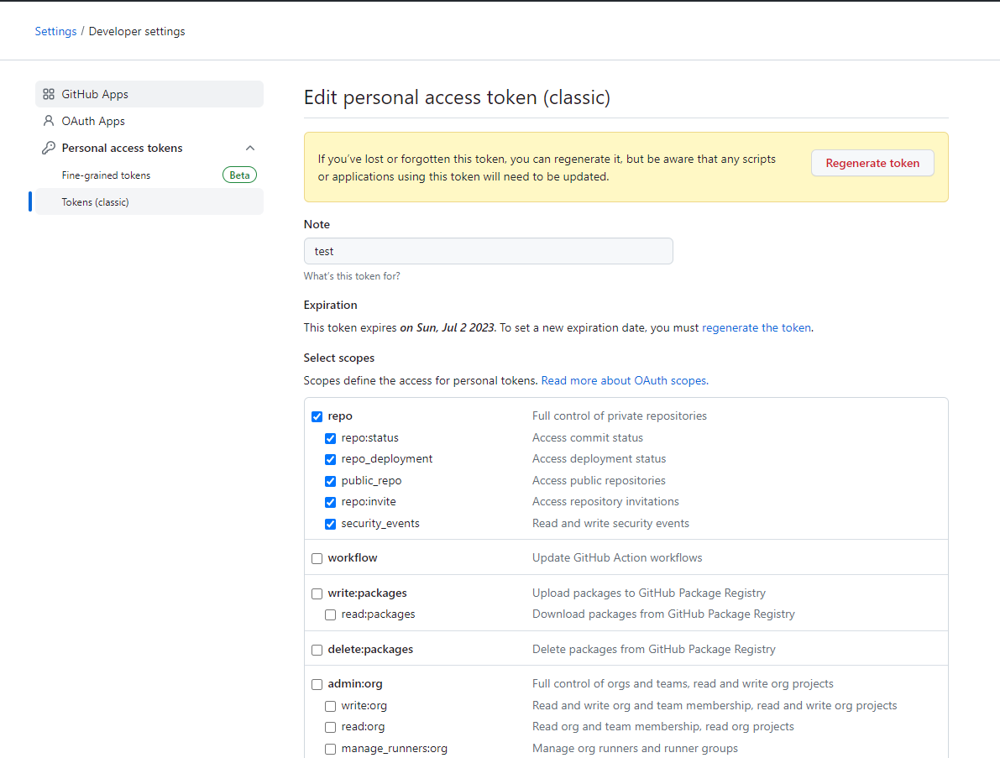

   

# FileBrowser - Implementing Git Utilities
***
## **Project Introduction**
This repository contains source codes which used for Open Source Software Project Course assignment in the Department of Computer Science and Engineering at Chung-Ang University. We implemented a **GUI-based git repository management service**. 
## **Application**

   

### **GUI**
  
**1. GUI Composition** 

    

(1) **File Explorer Panel**: A panel for navigating files and folders.  
(2) **File Text Panel**: Displays the file path and, in the case of a git repository, provides the current branch name. If it's not a git repository, a *"git clone"* button is provided.  
(3) **Central Panel**: Shows the contents of the selected folder. If it's a git repository, it also provides file status information(icons).  
(4) **Commit Panel**: A panel that offers key git functions such as staging, unstaging, and committing.  
(5) **Repository Button**: Allows creating a repository or opening the commit panel and branch panel.  
(6) **Branch Panel**: Displays a list of branches. In this panel, you can choose options like *create, delete, rename, and checkout*.  
   
 

**2. File Status Icon**  
**(1) Unstaged**  
This is the state of modified or newly created files before executing the *git add* command.

|Icon|Status|Description|
|:--:|:--:|:--:|
||Untracked|State of newly created files not tracked by Git| 
||Modified|State of existing files that have been modified|  
||Ignored|Files set to be ignored by Git tracking|

**(2) Staged**    
State of modified or newly created files ready to be tracked by Git after executing the *git add* command.

|Icon|Status|Description|
|:--:|:--:|:--:|
||Added|State of newly created files added to the staging area|  
||Changed|State of previously unmodified files that have been modified and added to the staging area using the *git add* command|  
||Removed|State of existing files that have been deleted and added to the staging area using the *git add* command|

**NOTICE**   
No status information is provided for ignored or committed (unmodified) files. Clicking the *Commit* button will instantly remove the files from the staging area and the status icon will disappear, indicating that they have transitioned to the committed state.

 

### **Key Project Features**
#### **1. Git Repository Creation**
- Click the *Create Repository* button located in the top right corner of the GUI to create a git repository. Duplicate creation is not allowed.

#### **2. Version Controlliong**
- **Popup Menu Based on File Status**
   - When right-clicking on a file, a git popup menu specific to its status will appear. You can observe real-time changes in the file's status based on the selected menu option.
   - Popup Menu Example (committed state)    
     

   The configuration of the popup menu provided for each status is as follows: 
   |Status|Popup Menu|
   |--|--|
   |untracked|Add to git|
   |modified|Add to git Unmodifying|
   |staged|Unstage changes|
   |committed|Untracking Delete file Rename tracked file|

- **Staging Area Management and Commit**
   - Click the *Commit Menu* button located in the top right corner of the GUI to open the commit panel. However, it won't open if the current folder is not a git repository..
   - Write a commit message and click the *Commit* button to transition the files to the committed (unmodified) state.
   - Use the *Stage* and *Unstage* buttons to move files between the staging area and the unstaged state. This allows you to stage files that are currently unstaged or unstage files that are currently in the staging area.

#### **3. Branch Management**
- **branch management**
   - Various menus can be accessed by right-clicking on the branch panel.  
   - Provides options for *creating, deleting, renaming, and checking out* branches.  
   - And the menu of deleting branch doesn't appear in current branch.  

- **branch merge**
   - Clicking the *merge* button within the branch panel allows you to view a list of mergeable branches and perform the desired merge with the selected branch.
   - Upon successful merge, a success message is displayed. In case of failure, an error message and unmerged paths are provided, and the merge process is automatically aborted.

#### **4. Show Commit History**
- Clicking the *Commit Menu* button opens a popup window displaying the commit history.
- Information such as commit message, author, and creation date is available for each commit.
- By clicking on a commit object in the graph, you can view the changes stored in that object. Changes are categorized as ADD, MODIFY, or DELETE. If there are additions in the current code compared to the previous commit (ADD), deleted code files (DELETE), or modifications in the code content (MODIFY), information regarding these changes is provided.
- Commit history example  
  

#### **5. Repository Clone**
- You can clone a repository within a remote repository by using the *clone* button. 
- To clone a repository, you need the address of the repository. If it is a private repository, you will also need to provide your user ID and token.  
- If you don't have a valid token, you have to create an access token in 'Github > Settings > Developer settings > Personal access token'.
- Upon successful cloning of a private repository, an auth.txt file containing your ID and token will be automatically generated in the project folder.  
- And auth.txt will be used when the program restarts.
 

**WARNING**    
To ensure a smooth cloning process, **don't forget to specify the access scope when generating your token!** (Refer to the image below)  
  

 

For more detailed explanations of the features, please refer to the
[document](./papers/team_20_project1.pdf)  (The document is written in Korean.)   
   

## **How to Execute**
**Target platform : Windows**  
**Development and Execution Environmen : IntelliJ IDEA Ultimate**  
**Language and Version : JAVA, JDK-17**  
**Build Tool and Version : gradle 8.0**  

### Below are the steps to run the project.  
1. Clone the project. `git clone https://github.com/advicewook/FileBrowser.git`  
2. Open the cloned project folder with IntelliJ IDEA Ultimate.    
3. Wait for IntelliJ IDEA's indexing to complete after loading the Gradle project. You can check the progress in the progress bar at the bottom right.  
4. Open the Gradle tab in the upper right corner and click "Reload".    
     
5. Change the IntelliJ settings as follows in File > Settings. The Gradle user home path below is an example.    
         
      
6. Change the IntelliJ settings in File > Project Structure as follows.     
      
7. Once the reload is complete, open the Edit Configuration window in the upper right corner.    
     
8. Modify the configuration values as shown in the image below. If you don't have JDK 17, you can download it from the link on the right (https://www.oracle.com/kr/java/technologies/javase/jdk17-archive-downloads.html)   
      
9. After completing the configuration, save and close the Configuration window. Then, click the Run button in the upper right corner to run the application.  
     
10. Example of the execution result  
     

### Below are the steps to build with Gradle and execute the jar file.  
1. Complete steps 1 to 6 of the above project execution method. 
2. Modify the configuration values as shown in the image below.  
     
3. Save and close the Configuration window.   
4. After completing the settings, click the Run button in the upper right corner to execute the Gradle build command.    
     
6. If the build is successful, you will see the following log, and the build output will be generated as a jar file in /build/libs.    
     
7. You can execute the generated jar file using `java -jar FileBrowser-1.0-SNAPSHOT.jar`.    
8. Example of the execution result  
      

   

## **Development History**

|Date|Progress|
|--|--|
|23-04|Exploration of suitable open-source projects and selection of programming languages|
|23-05-01|Changed Eclipse project to Gradle project|  
|23-05-03|1. Added commit menu UI   2. Completed commit panel creation    3. Implemented commit menu and repository creation button functionality|
|23-05-04|1. Completed commit panel functionality   2. Completed popup menu functionality|
|23-05-05|1. Created file status icons   2. Improved commit panel functionality|
|23-05-09|1. Improved file status display in the central panel   2. Improved commit menu button behavior    3. Improved commit panel functionality|
|23-05-10|1. Fixed issues with subfolders under repositories (popup menu creation and functionality based on status)   2. Implemented commit functionality   3. Completed file status icon functionality in the central panel|
|23-05-11|Fixed popup menu issues and made some code modifications|
|23-05-13|Created project1 document and readme|
|23-05-26|1. Completed branch panel UI   2. Implemented repository clone functionality|
|23-05-27|Improved repository clone functionality - private repository clone|
|23-05-29|1. Implemented branch merge functionality   2. Implemented branch create, delete, rename, checkout functionality|
|23-05-31|Drafted commit history graph functionality|
|23-06-01|	1. Consolidated and improved branch panel functionality   2. Improved repository clone functionality - token handling|
|23-06-03|Added additional UI for commit history graph|
|23-06-03|Added commit history graph functionality|
|23-06-05|1. Fixed issues with branch merge - providing conflicting file path information and adding cancel button functionality   2. Improved repository clone functionality - creation of user ID and token information file (auth.txt)|
|23-06-08|Created project2 document and readme|

   

## **Details**
### Main Dependencies
- Jgit: Managed by Eclipse Foundation, it provides support for invoking git commands as Java methods.
- Swing : A Java-based GUI library that provides classes for creating Java-based graphical interfaces.

### Reference Repository
- https://github.com/centic9/jgit-cookbook
  - Provides code snippets for using Jgit more conveniently and implementing git functionality.

### Java Classes
- FileBrowser: The core class that implements the file browser.
- CustomJgitUtilities: The class responsible for implementing git functionality using Jgit.
- CustomSwingUtilities: The class that implements the GUI using Swing.
- UserInfoForGit: Class for Managing ID, Token, FilePath, and Information Storage

***
## Original Project Introduction
> Writing a simple file browser in Java SWING

The original project is a file browser implemented in Java.
***
### Links
- [E-mail : ](mailto:m.elkhou@hotmail.com) m.elkhou@hotmail.com
- [GitHub](https://github.com/m-elkhou)

