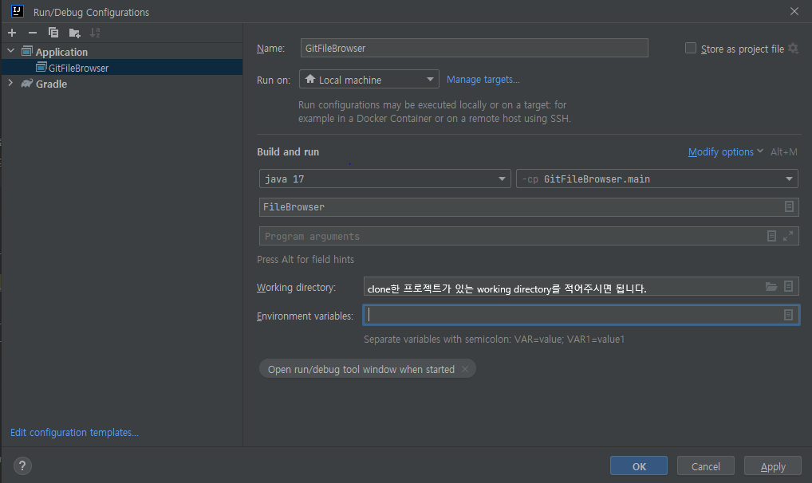

   

# FileBrowser - Implementing Git Utilities

***
## **Project Introduction**
> 중앙대학교 소프트웨어학부 23-1 오픈소스SW프로젝트 과목 과제 진행을 위한 레퍼지토리입니다. 과제에서 요구되는 GUI-based git repository management service를 구현했습니다.
## **Application**

### **GUI**
**1. GUI 구성** 

    

(1) 파일 탐색 패널 : 파일 및 폴더를 탐색하는 패널입니다.   
(2) 중앙 패널 : 선택한 폴더의 내부 요소를 보여줍니다. git 저장소라면 파일의 상태 정보(아이콘)이 함께 제공됩니다.    
(3) 저장소 버튼 : 저장소를 생성하거나 커밋 패널을 여는 버튼이 존재합니다.     
(4) 커밋 패널 : staging, unstaging, commit 등 주요 git 기능을 제공하는 패널입니다.      

**2. 파일 상태 아이콘**  
**(1) Unstaged**  
변경된 파일이나 새로 생성한 파일 중 git add 명령을 실행하기 전의 상태입니다.  

|아이콘|상태|설명|
|:--:|:--:|:--:|
||Untracked|새로 생성된 파일로 Git이 추적하지 않는 상태| 
||Modified|기존 파일이 수정된 상태|  
||Ignored|Git이 추적하지 않도록 설정한 파일|

**(2) Staged**    
수정된 파일이나 새로 생성한 파일 중 git add 명령을 실행하여 Git이 추적할 준비가 된 상태입니다.   
|아이콘|상태|설명|
|:--:|:--:|:--:|
||Added|새로 생성한 파일이 스테이지 영역에 추가된 상태|  
||Changed|unmodified 상태였던 파일이 수정되고 git add 명령을 실행하여 스테이지 영역에 추가된 상태|  
||Removed|기존 파일이 삭제되고 git add 명령을 실행하여 스테이지 영역에 추가된 상태|

**NOTICE:**
ignored, committed(unmodified)에 대한 상태 정보는 제공하지 않습니다. *Commit* 버튼을 클릭하면 실시간으로 파일이 staging area에서 벗어나고 상태 아이콘이 사라지는 것을 통해 commited 상태로 변경되었음을 확인할 수 있습니다. 

### **프로젝트 주요 기능**
#### **1. Git repository 생성**
- GUI 우측 상단의 *Create Repository*버튼을 클릭하여 git 저장소를 생성할 수 있습니다. 단, 중복 생성은 불가능합니다.

#### **2. Version controlliong**
- **파일 상태별 팝업 메뉴 제공**
   - 마우스 우클릭 시 파일 상태에 따라 서로 다른 git 팝업 메뉴가 나타납니다. 선택시 해당 메뉴에 맞게 실시간으로 파일의 상태가 변하는 것을 확인할 수 있습니다. 
   - 팝업메뉴 예시(committed 상태)  
     

   상태별 제공되는 팝업 메뉴의 구성 아래와 같습니다. 
   |상태|팝업 메뉴|
   |--|--|
   |untracked|Add to git|
   |modified|Add to git Unmodifying|
   |staged|Unstage changes|
   |committed|Untracking Delete file Rename tracked file|

- **Staging area 관리 및 Commit 기능 제공**
   - GUI 우측 상단의 *Commit Menu* 버튼을 클릭하여 커밋 패널을 열 수 있습니다. 단, git 저장소가 아닌 폴더에서는 열리지 않습니다.
   - commit 메세지를 작성하고 *Commit* 버튼을 클릭하여 파일을 committed(unmodified) 상태로 만들 수 있습니다.
   - *Stage*, *Unstage* 버튼을 클릭하여 Staging area에 올라온 파일을 Unstaging 하거나 Unstaged 상태의 파일을 Staging area로 올릴 수 있습니다.

기능에 대한 보다 자세한 설명은 아래의 문서를 참고하세요. (링크추가예정)  
   

## **How to Execute**

**개발 및 실행 환경 : IntelliJ IDEA Ultimate**  
**언어 및 버전 : JAVA, JDK-17**  
**빌드 툴 및 버전 : gradle 8.0**  

### 아래는 프로젝트 실행 방법입니다.
1. 프로젝트를 클론합니다. `git clone https://github.com/advicewook/FileBrowser.git`  
2. IntelliJ Ultimate IDEA로 clone한 프로젝트 폴더를 엽니다.  
3. Load Gradle Project후에 IntelliJ Ultimate IDEA의 인덱싱이 끝날 때까지 기다립니다. 이는 우측 하단의 프로그레스바에서 확인할 수 있습니다.  
4. 우측 상단 Gradle 탭을 열고 reload합니다.  
     
5. File > Settings에서 Intellij의 설정값을 아래와 같이 변경합니다. 아래에서 Gradle user home 경로는 예시입니다.  
         
      
6. File > Project Structure에서 Intellij의 설정값을 아래와 같이 변경합니다.   
      
7. reload가 끝나면 우측 상단의 Edit Configuration 창을 엽니다.  
     
8. 아래 이미지를 참고하여 설정값을 변경합니다. JDK17이 없다면 우측 링크에서 다운로드받으실 수 있습니다.(https://www.oracle.com/kr/java/technologies/javase/jdk17-archive-downloads.html)   
      
9. 설정이 완료되면 저장 후 Configuration창을 닫습니다. 이후 우측 상단에서 Run 버튼을 눌러 애플리케이션을 실행할 수 있습니다.  
     
10. 실행 결과 예시  
     

### 아래는 gradle을 이용한 빌드 후 jar파일 실행 방법입니다.  
1. 프로젝트 실행 방법의 6번까지 완료한 후 7번을 실행합니다.  
2. 아래 이미지를 참고하여 설정값을 변경합니다.  
     
3. 설정이 완료되면 저장 후 Configuration창을 닫습니다.  
4. 설정을 마친 후, 우측 상단에서 Run 버튼을 눌러 gradle 빌드 명령을 실행합니다.  
     
6. 빌드가 성공적으로 끝났다면 아래와 같은 로그가 출력되고, 빌드 결과물은 /build/libs에 jar파일로 생성됩니다.  
     
7. 이 결과물은 `java -jar FileBrowser-1.0-SNAPSHOT.jar`으로 실행할 수 있습니다.   
8. 실행 결과 예시  
      

   

## **Main History**

|날짜|진행 상황|
|--|--|
|23-04|적절한 오픈 소스 탐색 및 프로그래밍 언어 선정|
|23-05-01|eclipse project를 gradle project로 변경|  
|23-05-03|1. commit menu ui 추가    2. 커밋 패널 생성 완료   3. commit menu, repository creation 버튼 기능 구현 완료|
|23-05-04|1. 커밋 패널 기능 구현 완료   2. 팝업 메뉴 기능 구현 완료|
|23-05-05|1. 파일 상태 아이콘 제작 완료   2. 커밋 패널 기능 개선|
|23-05-09|1. 중앙 패널 파일 상태 표시 기능 개선   2. 커밋 메뉴 버튼 동작 개선   3. 커밋 패널 기능 개선|
|23-05-10|1. 레포지토리 하위 폴더 동작 오류 개선 (status에 따른 팝업 메뉴 생성 및 선택 시 기능 동작)    2. 커밋 기능 구현 완료   3. 중앙 패널 안 파일의 상태 표시 아이콘 기능 완성 |
|23-05-11|팝업 메뉴 오류 개선 및 일부 코드 수정|
|23-05-13| 문서 및 리드미 작성|

   

## **Details**
### 주요 의존성
- Jgit : Eclipse Foundation에서 관리하는, git 명령어를 java 메서드로 호출할 수 있도록 지원합니다.
- Swing : 자바로 작성된 GUI 라이브러리입니다. 자바 기반의 그래픽 인터페이스를 만들 수 있는 클래스를 제공합니다.

### 참고 리포지토리
- https://github.com/centic9/jgit-cookbook
  - Jgit을 편하게 사용할 수 있도록 git 기능에 대한 code snippet을 제공합니다.

### 자바 클래스
- FileBrowser : 파일 브라우저를 구현하는 핵심 클래스입니다.
- CustomJgitUtilities : jgit을 사용한 git 기능 구현을 담당하는 클래스입니다.
- CustomSwingUtilities : swing을 사용해 gui을 구현하는 클래스입니다.

***
## Original Project Introduction
> Writing a simple file browser in Java SWING

원본 프로젝트는 java로 구현한 file browser입니다.
***
### Links
- [E-mail : ](mailto:m.elkhou@hotmail.com) m.elkhou@hotmail.com
- [GitHub](https://github.com/m-elkhou)

